# Social Media API
This application is the back end for a potential social media website. It allows a user to Create, Read, Update and Delete Users as well as their posts, which we will refer to as thoughts.
 ### Link to deployed application
 
## Table of Contents
* [Installation](#installation)
* [Usage](#usage)
* [License](#license)
* [Contributing](#contributing)
* [Tests](#tests)
* [Questions](#questions)
 
## Installation
Run ```npm install``` to install all required dependencies.
 
## Usage

### GET Requests
To get all available users, send a GET request to ```http://localhost:3001/api/users```

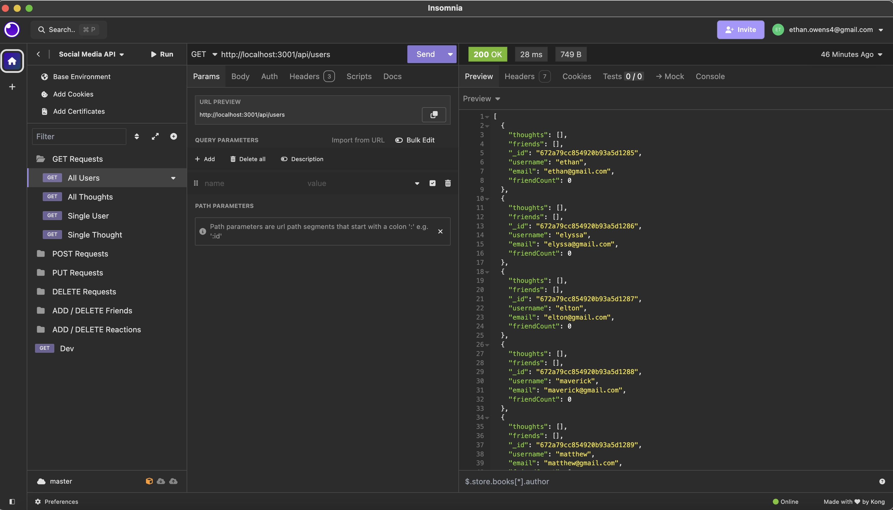


To get a single user, add the user's ```_id``` to the end of the above URL.

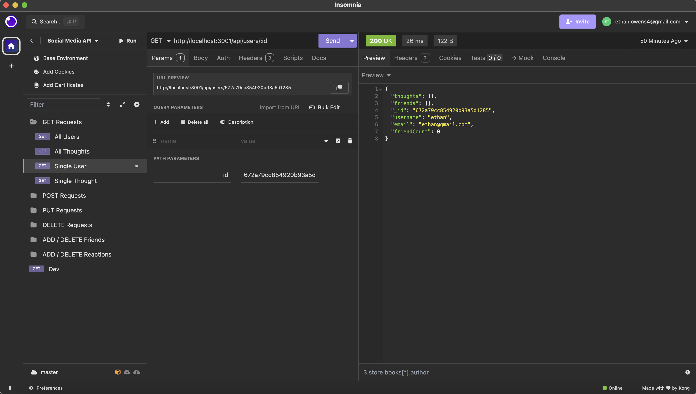


To get all available thoughts, send a GET request to ```http://localhost:3001/api/thoughts```

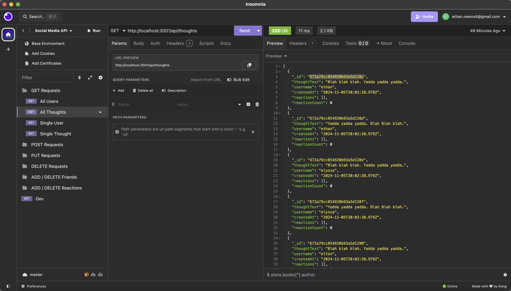


To get a single thought, add the thought's ```_id``` to the end of the above URL.

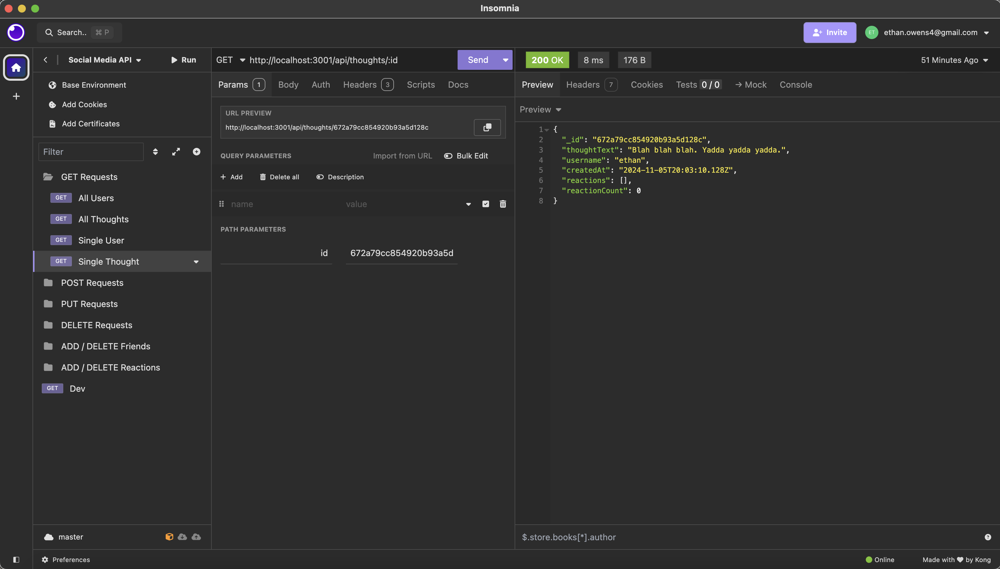


### POST Requests
To create a new user, send a POST request to ```http://localhost:3001/api/users```. Include a username and an email in the Request Body.

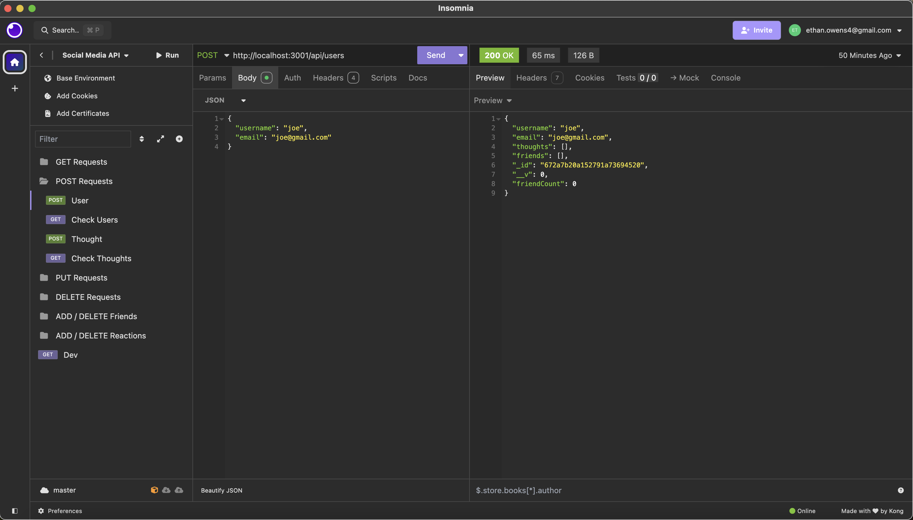


To create a new thought, send a POST request to ```http://localhost:3001/api/thoughts```. Include a thoughtText and a username in the Request Body.

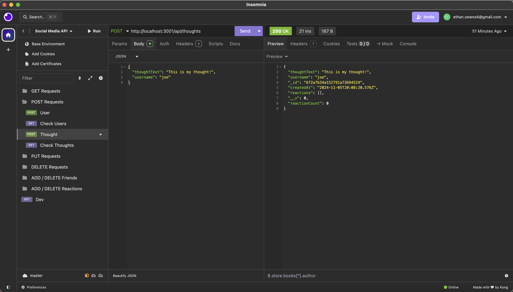

### PUT Requests
To update a user, send a PUT request to ```http://localhost:3001/api/users```. Include the user's ```id``` at the end of the URL. Include any information that you want to update in the Request Body.

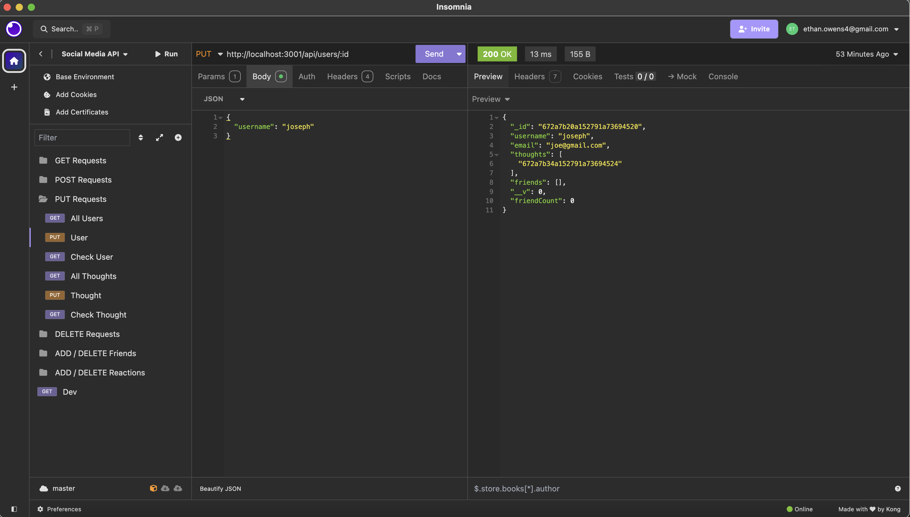

To update a thought, send a PUT request to ```http://localhost:3001/api/thoughts```. Include the thought's ```id``` at the end of the URL. Include any information that you want to update in the Request Body.

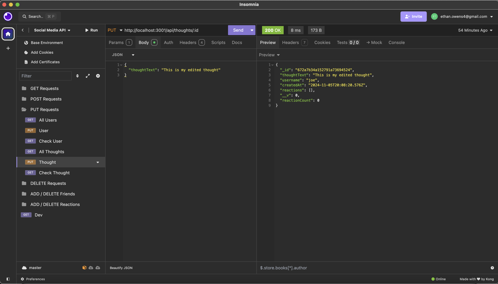

### DELETE Requests
To delete a user, send a DELETE request to ```http://localhost:3001/api/users```. Include the user's ```_id``` at the end of the URL.

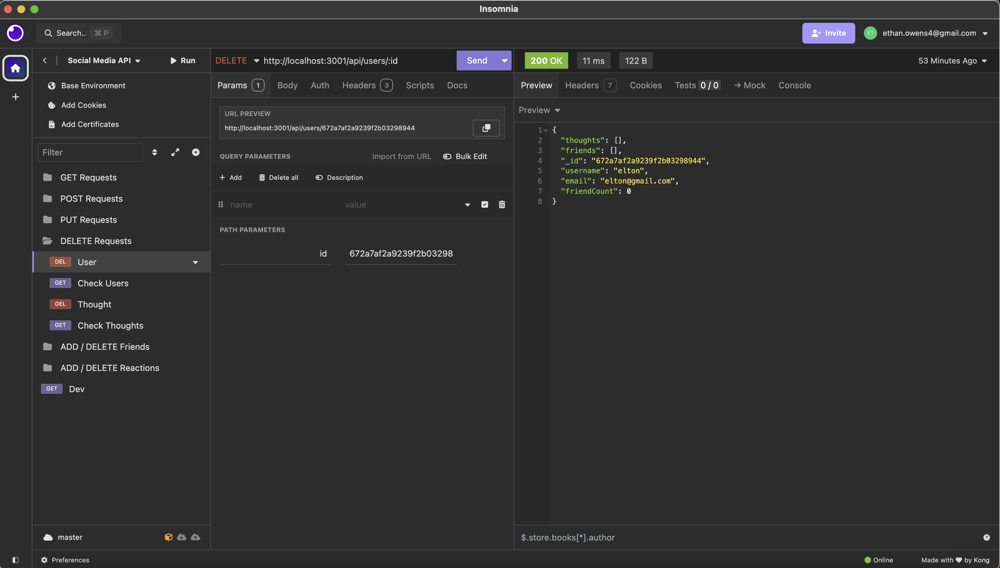

To delete a thought, send a DELETE request to ```http://localhost:3001/api/thoughts```. Include the thought's ```_id``` at the end of the URL.

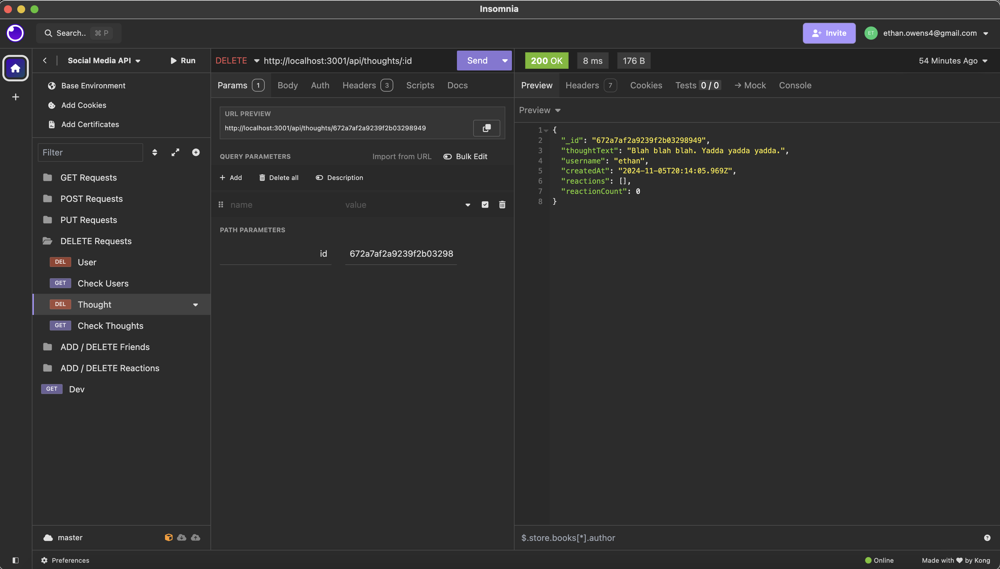

### Add Friends
To add a friend to a user's friends list, send a POST request to ```http://localhost:3001/api/users```. Include the user's ```_id``` at the end along with ```/friends``` and the new friend's ```_id``` in the URL.

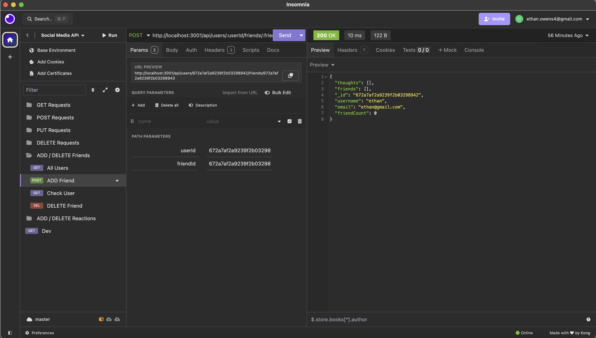

### Delete Friends
To remove a friend to a user's friends list, send a DELETE request to ```http://localhost:3001/api/users```. Include the user's ```_id``` at the end along with ```/friends``` and the ```_id``` for the friend that you want to remove in the URL.

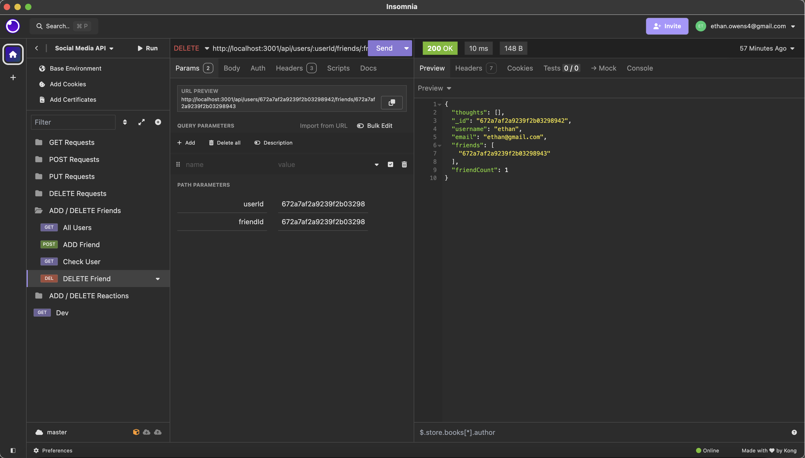

### Add Reactions
To add a reaction to a thought, send a POST request to ```http://localhost:3001/api/thoughts```. Include the thought's ```_id``` at the end along with ```/reactions``` in the URL.

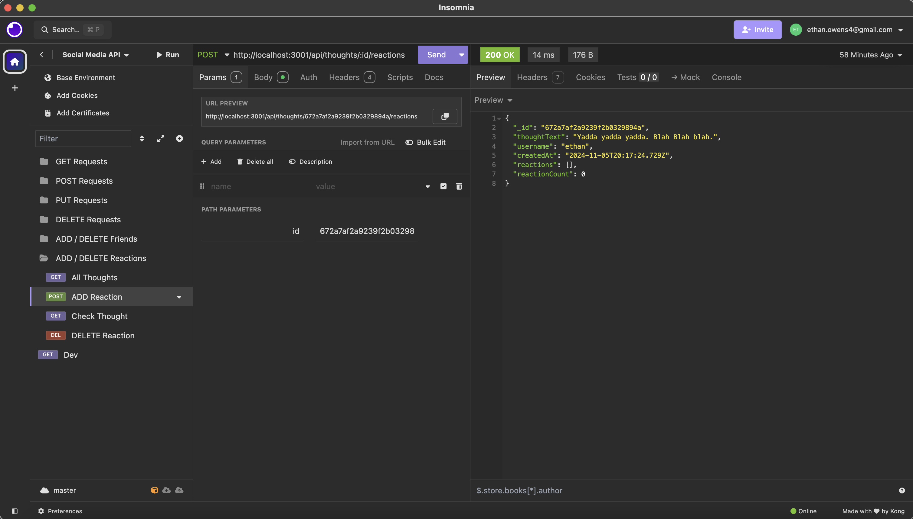

### Delete Reactions
To remove a reaction from a thought, send a DELETE request to ```http://localhost:3001/api/thoughts```. Include the thought's ```_id``` at the end along with ```/reactions``` in the URL. Then add the reaction in the Request Body.

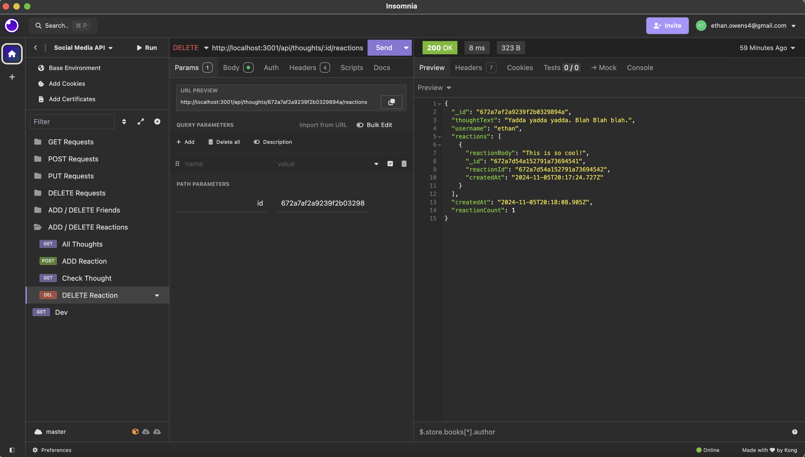
 
## License
[](https://opensource.org/licenses/MIT)

MIT License

Copyright (c) 2024 Ethan Robert Owens

Permission is hereby granted, free of charge, to any person obtaining a copy
of this software and associated documentation files (the "Software"), to deal
in the Software without restriction, including without limitation the rights
to use, copy, modify, merge, publish, distribute, sublicense, and/or sell
copies of the Software, and to permit persons to whom the Software is
furnished to do so, subject to the following conditions:

The above copyright notice and this permission notice shall be included in all
copies or substantial portions of the Software.

THE SOFTWARE IS PROVIDED "AS IS", WITHOUT WARRANTY OF ANY KIND, EXPRESS OR
IMPLIED, INCLUDING BUT NOT LIMITED TO THE WARRANTIES OF MERCHANTABILITY,
FITNESS FOR A PARTICULAR PURPOSE AND NONINFRINGEMENT. IN NO EVENT SHALL THE
AUTHORS OR COPYRIGHT HOLDERS BE LIABLE FOR ANY CLAIM, DAMAGES OR OTHER
LIABILITY, WHETHER IN AN ACTION OF CONTRACT, TORT OR OTHERWISE, ARISING FROM,
OUT OF OR IN CONNECTION WITH THE SOFTWARE OR THE USE OR OTHER DEALINGS IN THE
SOFTWARE.
 
## Contributing
Send any code snippits or suggestions to my email or send me a message on GitHub. Both are below!!!
 
## Tests
Seed the database with ```npm run seed``` and then utilize an API tool such as Insomnia to test each of the routes work.
 
## Questions
* GitHub: [@Teacher2Coder](https://www.github.com/Teacher2Coder)
* Email: ethan.owens4@gmail.com